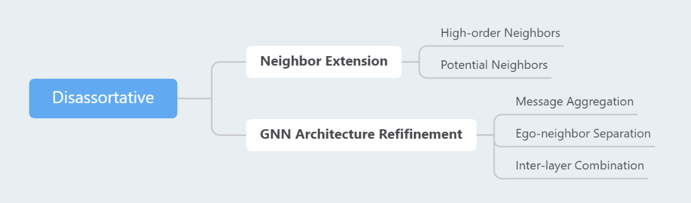

# DL for Disassortative Graphs

This repo collects papers about developing deep learning methods on disassortative graphs.

Disassortative graphs refer to those with a low node homophily. In disassortative graphs, nodes with the same label could be distant from each other and nodes with distinct labels are more likely to be connected with edges.

**Please feel free to submit a pull request if you want to add good papers.**

SURVEY
* [Arxiv 2023] **Graph Neural Networks for Graphs with Heterophily: A Survey** [[Paper]](https://arxiv.org/abs/2202.07082)

2023
----
* [ICLR 2023] **The Impact of Neighborhood Distribution in Graph Convolutional Networks** [[Paper]](https://openreview.net/forum?id=XUqTyU9VlWp) - [Potential Neighbors + Message Aggregation]

2022
----
* [AAAI 2022] **Powerful Graph Convolutioal Networks with Adaptive Propagation Mechanism for Homophily and Heterophily** [[Paper]](https://arxiv.org/abs/2112.13562) - [Potential Neighbors] 
* [AAAI 2022] **Block Modeling-Guided Graph Convolutional Neural Networks** [[Paper]](https://arxiv.org/abs/2112.13507) [[Code]](https://github.com/hedongxiao-tju/BM-GCN) - [Potential Neighbors + Ego-neighbor Separation]
* [AAAI 2022] **Graph pointer neural networks** [[Paper]](https://arxiv.org/abs/2110.00973) - [Potential Neighbors + Message Aggregation]
* [WWW 2022] **GBK-GNN: Gated Bi-Kernel Graph Neural Networks for Modeling Both Homophily and Heterophily** [[Paper]](https://arxiv.org/abs/2110.15777) [[Code]](https://github.com/Xzh0u/GBK-GNN)
* [ICLR 2022] **Is Homophily a Necessity for Graph Neural Networks?** [[Paper]](https://openreview.net/forum?id=ucASPPD9GKN) 

2021
----
* [arXiv 2021] **Is Heterophily A Real Nightmare For Graph Neural Networks To Do Node Classification?** [[Paper]](https://arxiv.org/abs/2109.05641) - [Message Aggregation + Ego-neighbor Separation]
* [arXiv 2021] **Two Sides of the Same Coin: Heterophily and Oversmoothing in Graph Convolutional Neural Networks** [[Paper]](https://arxiv.org/abs/2102.06462v2) - [Message Aggregation + Ego-neighbor Separation]
* [TPAMI] **Non-Local Graph Neural Networks** [[paper]](https://arxiv.org/abs/2005.14612) [[code]](https://github.com/divelab/Non-Local-GNN) - [Potential Neighbors + Message Aggregation]
* [NeurIPS 2021] **Universal Graph Convolutional Networks** [[Paper]](https://openreview.net/forum?id=MSXDyfli9vy) [[Code]](https://github.com/jindi-tju/U-GCN) - [High-order Neighbors + Potential Neighbors]
* [NeurIPS 2021] **Large Scale Learning on Non-Homophilous Graphs: New Benchmarks and Strong Simple Methods** [[Paper]](https://arxiv.org/abs/2110.14446) [[Code]](https://github.com/CUAI/Non-Homophily-Large-Scale)
* [NeurIPS 2021] **Diverse message passing for attribute with heterophily** [[Paper]](https://proceedings.neurips.cc/paper/2021/hash/253614bbac999b38b5b60cae531c4969-Abstract.html) - [Message Aggregation]
* [KDD 2021] **Breaking the Limit of Graph Neural Networks by Improving the Assortativity of Graphs with Local Mixing Patterns** [[Paper]](https://dl.acm.org/doi/abs/10.1145/3447548.3467373) [[Code]](https://github.com/susheels/gnns-and-local-assortativity) - [Potential Neighbors + Message Aggregation + Ego-neighbor Separation]
* [ICML 2021] **Graph Neural Networks Inspired by Classical Iterative Algorithms** [[Paper]](https://arxiv.org/abs/2103.06064) [[Code]](https://github.com/FFTYYY/TWIRLS)
* [Workshop on Graph Learning Benchmarks, WWW 2021] **New Benchmarks for Learning on Non-Homophilous Graphs** [[Paper]](https://graph-learning-benchmarks.github.io/assets/papers/Non_Homophilous_Camera_Ready.pdf)[[Code]](https://github.com/CUAI/Non-Homophily-Benchmarks)
* [ICLR 2021] **How to Find Your Friendly Neighborhood: Graph Attention Design with Self-Supervision** [[Paper]](https://openreview.net/forum?id=Wi5KUNlqWty) [[Code]](https://github.com/dongkwan-kim/SuperGAT)
* [ICLR 2021] **Adaptive Universal Generalized PageRank Graph Neural Network** [[Paper]](https://openreview.net/forum?id=n6jl7fLxrP) [[Code]](https://github.com/jianhao2016/GPRGNN) - [Inter-layer Combination]
* [WSDM 2021] **Node Similarity Preserving Graph Convolutional Networks** [[Paper]](https://arxiv.org/abs/2011.09643) [[Code]](https://github.com/ChandlerBang/SimP-GCN) - [Potential Neighbors]
* [AAAI 2021] **Beyond Low-frequency Information in Graph Convolutional Networks** [[Paper]](https://arxiv.org/abs/2101.00797) [[Code]](https://github.com/bdy9527/FAGCN) - [Message Aggregation]
* [AAAI 2021] **Graph Neural Networks with Heterophily** [[Paper]](https://arxiv.org/abs/2009.13566) [[Code]](https://github.com/GemsLab/CPGNN) - [Message Aggregation]
* [CIKM 2021] **Tree decomposed graph neural network** [[Paper]](https://arxiv.org/abs/2108.11022) [[Code]](https://github.com/YuWVandy/TDGNN) - [High-order Neighbors]

2020
----
* [NeurIPS 2020] **Beyond Homophily in Graph Neural Networks: Current Limitations and Effective Designs** [[Paper]](https://arxiv.org/abs/2006.11468) [[Code]](https://github.com/GemsLab/H2GCN) - [High-order Neighbors + Ego-neighbor Separation + Inter-layer Combination]
* [ICML 2020] **Simple and Deep Graph Convolutional Networks** [[Paper]](https://arxiv.org/abs/2007.02133) [[Code]](https://github.com/chennnM/GCNII) - [Inter-layer Combination]
* [KDD 2020] **Residual Correlation in Graph Neural Network Regression** [[Paper]](https://arxiv.org/abs/2002.08274) [[Code]](https://github.com/000Justin000/gnn-residual-correlation)
* [ICLR 2020] **Geom-GCN: Geometric Graph Convolutional Networks** [[Paper]](https://openreview.net/forum?id=S1e2agrFvS) [[Code]](https://github.com/graphdml-uiuc-jlu/geom-gcn) - [Potential Neighbors]

2019
----
* [ICML 2019] **Mixhop: Higher-order graph convolutional archi?tectures via sparsified neighborhood mixing** [[Paper]](http://proceedings.mlr.press/v97/abu-el-haija19a.html) [[Code]](https://github.com/benedekrozemberczki/MixHop-and-N-GCN) - [High-order Neighbors]

2018
----
* [ICML 2018] **Representation learning on graphs with jumping knowledge networks** [[Paper]](http://proceedings.mlr.press/v80/xu18c.html) [[Code]](https://github.com/dmlc/dgl/tree/master/examples/pytorch/jknet) - [Inter-layer Combination]
